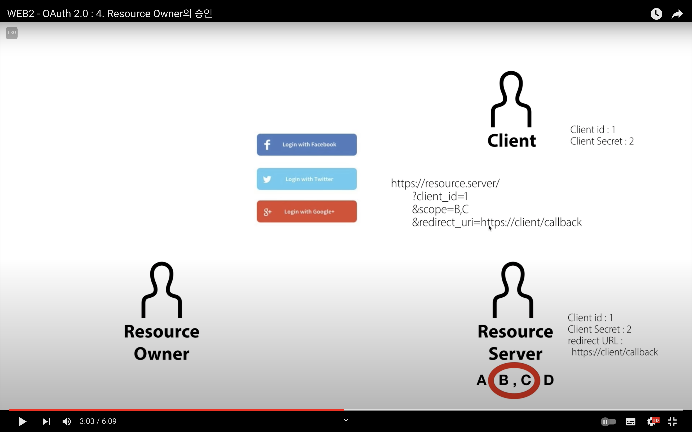

| [참조 유투브 - 생활코딩 OAuth 개념 재생목록](https://opentutorials.org/course/3405)

## OAuth란?

- OAuth를 통해 accessToken을 얻어낼 수 있고, 이를 이용해서 필요한 데이터를 안전하게 CRUD할 수 있음.
- 서비스는 회원의 아디 비번을 저장하지 않고 회원을 식별할 수 있게 해줌.
- 3자 간에 어떻게 신뢰성을 가지는 관계를 맺을 수 있을까라는 배경으로 나온 기술
- federated identity

## OAuth 역할

- Resource Server: 제어할 자원을 가지고 있는 서버
    - Authorization Server: 인증과 관련된 처리를 전담하는 서버
    (공식문서에는 리소스와 어쏘레이션 구분하지만, 일반적으로는 Resource⊃Authorization
- Resource Owner: 자원의 소유자
- Client: 리소스 서버에 접속해 정보를 가져가는 우리 서비스
- 장점: 클라이언트가 리소스 서버를 통해 리소스 오너의 신원을 인증할 수 있음.

## OAuth 동작과정

### 1. 등록(Register)

> 클라이언트가 리소스 서버를 이용하기 위해서는 리소스 서버에 승인을 사전에 받아놓음
>

서비스마다 다르지만, 등록 시 공통적으로 받는 것들

- `ClientID` : 애플리케이션을 식별하는  id
- `ClientSecret`: `ClientID` 에 대한 비밀번호
    - 외부에 절대로 노출되면 안됨!
- `Authorized redirect URLs` : 리소스 서버가 권한을 부여하는 과정에서 Authorized Code라는 값을 전달해줄는데, 이 때 리소스 서버가 코드를 전달할 주소
    - 다른 주소로 요청하면 리소스 서버는 무시함.

### 2. Resource Owner의 승인

> 클라이언트가 서비스(클라이언트)를 통해 리소스 서버 기능을 쓰기 전, 기능을 쓰기 위해 로그인 및 동의함.
>
1. 서비스에서 리소스 서버 인증 및 로그인을 위한 리소스 서버 로그인 버튼(url)을 제공
    - 로그인 버튼 url에는 클라이언트 id, 사용하고자 하는 기능, 리다이렉트 url이 포함되어 있음.

1. 로그인 버튼을 눌러 리소스 오너가 저 url로 가게되면, 리소스 서버에서 로그인 여부를 판단 후 상태에 따라 리소스 서버가 조치
    1. 로그인 실패 → 로그인 화면을 띄워줌.
    2. 로그인 성공
        1. url에 있는 클라이언트 id로 같은 id가 있는지 확인하고, 
        2. 해당 id의 리다이렉트 url과 요청 url 속 리다이렉트 url이 같은지 확인 (다르면 작업 끝냄)
        3. 리소스 오너에게 scope에 해당하는 권한을 클라이언트에 부여할 것인지를 확인하는 메시지 전송

1. 리소스 오너가 권한 승인을 완료하면, 리소스 서버는 유저 id에 대해 권한을 승인한 scope 내용을 저장함.

### 3. Resource Server의 승인

> 액세스토큰을 발급하기 전, 3자 간에 일이니 리소스 서버가 한번 더 올바른 요청인지 검증함.
>

1. 임시 비밀번호인 authorization code를 만들어, 어쏘리제이션 코드와 리다이렉트 url을 함께 리소스 오너에 전송

1. 은밀하게 (리소스 오너인 사람이 모르게) 리소스 서버에게 받은 콜백을 클라이언트에 보냄.

1. 리다이렉을 받은 클라이언트는 어쏘리제이션 코드를 갖게 되고, 클라이언트가 리소스 서버에 직접 접속함.
    1. 그림과 같으니 형식으로, 어쏘리제이션 코드, 클라이언트 id, 시크릿 코드를 포함해서!
2. 리소스 서버는 클라이언트로 부터 받은 접속으로 각 값들이 모두 일치하면 승인을 완료함.

### 4. 액세스 토큰 발급

> AccessToken: 특정 유저가 권한을 가지는 기능들을 사용할 권한을 판별할 key, 이 액세스토큰을 가진 사람만 동작을 하게 해줌.
>
1. 리소스 서버는 어쏘리제이션 코드를 지우고, 액세스토큰 생성
2. 액세스토큰을 클라이언트에 전송, 클라이언트는 이를 저장함.

### 5. API 호출

> API: Application Programming Interface (클라이언트가 리소스 서버를 호출하는 방법)
>
- 액세스 토큰을 파라미터 쿼리아이템에 넣어 전송하는 방법과, 헤더의 Bearer에 넣어 전송하는 두 가지 방법이 있음.
- 액세스토큰은 공개되면 위험하니, 후자 방법이 선호됨.

### 6. refresh token

> refresh token: 액세스 토큰은 보통 수명이 있는데, 수명이 끝나면 다시 액세스 토큰 발급 과정을 거치면 힘드니 리프레시 토큰으로 액세스 토큰을 재발급받게 한다.
>

1. 리소스 서버가 액세스 토큰과 리프레시 토큰을 함께 제공
2. 액세스 토큰이 만료되어 에러를 받았다면, 클라이언트는 리프레시 토큰을 어쏘리제이션 서버에 다시 보냄.
    1. 리프레시 토큰은 계속 그대로고 엑세스 토큰만 갱신되고, 둘 다 갱신되는 경우도 있음.

